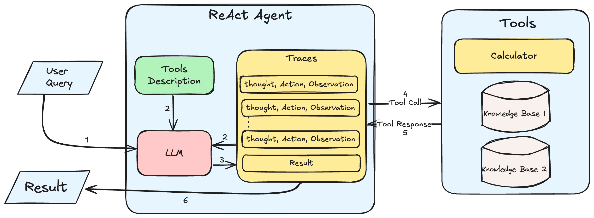

# Understanding and Building ReAct Agents

In this blog, we will understand what ReAct agents are, why they are required, the pros and cons of using them and also dive into how they work under the hood. We will also build a simple ReAct agent from scratch that can solve problems using external tools.

<!-- more -->

## What is a ReAct Agent?

A ReAct (Reasoning and Act) Agent is an autonomous agent architecture that uses reasoning and action planning capabilities of LLMs for general task solving. Given a task and the tools to solve it, a ReAct agent dynamically plans and executes a sequence of actions to solve the task.

## Why is it required?

### Limitations of Chain of Thought Prompting

CoT (Chain of Thought) prompting is not good enough for dynamic problem solving for the following reasons:

1. CoT follows a fixed sequence and cannot dynamically adapt based on the current state of the task.
2. CoT prompting typically does not have any access to external tools.
3. It does not perform well over long sequences of reasoning as hallucinations are more prevalent in CoT since the model is not groudned in truth.

### Limitation of Act-Only Agents

Act-only agents are not explainable. They are black-boxes that take in an input and produce an output. There is no way to understand why a particular action was taken. This is can be limiting especially when the agent prompt needs to be "debugged" and improved.

### How ReAct Agents Solve These Limitations

1. **Dynamic Planning**: ReAct agents can dynamically plan and execute a sequence of actions to solve a task based on the previous results.
2. **Accurate Information**: ReAct Agents integrate external tools such as APIs, databases, calculators, etc. to solve tasks. This makes sure that they have access to latest information and more accurate results to work with.
3. **Explainability**: sequences of ReAct agents contains a reasoning/thought step which can be used to understand why a particular action was taken.
4. **Reliability**: With each sequence contain a reasoning, action, and observation step the agent is more grounded and trustworthy, since the each sequence is more structured and constrained.

## Pros and Cons of ReAct Agents

### Pros

1. **Enhanced Problem Solving Abilities**: Since ReAct agents can use external tools and also dynamically adapt, they can create a wide range of sophisticated and lengthy workflows to solve a probelm reliably.
2. **Versatility**: ReAct Agents can handle a variety of tasks as long as they have necessary tools to access information that aid them.
3. **Access to new Information**: ReAct agents can access external tools and APIs to get the latest information to solve a task. Whereas CoT and other methods are limited to the information the model was trained on or is present in the prompt.

### Cons

1. **Requires Large Models**: For ReAct agents to work decently, larger language models such as GPT-3 or GPT-4 will have to be used.This means if the LLM being used is an open source model, then the computational overhead will be high, and if it is a closed source model, then the API costs will be higher.

2. **High Latency**: ReAct agents require large models and also takes multiple sequences to solve a task. This means that the latency of the agent will be high. This can be a problem for real-time applications.

3. **Simple ReAct agents setups may not be enough**: The ReAct agent prompt setup, workflow and the tools need to be carefully designed to make sure that the agent is able to solve the task. Especially when the task is highly domain specific or requires a lot of external information. A simple plug-and-play setup using LangChain/LlamaIndex may not be enough.

## Understanding the ReAct Agent Framework



The ReAct Agent Framework Diagram above shows the different components and the sequence in which they are used:

* **User Query**: The user query is the task that the ReAct agent needs to solve.
* **LLM**: The large language model is used to generate the reasoning and action steps.
* **Tools**: The tools are the external APIs, databases, calculators, etc. that the ReAct agent has access to solve the task.
* **Traces**: This is a list of steps takes by the React Agent to solve the task. Each step contains the following:
    1. Thought: The LLM's reasoning about the query why a particular action was taken.
    2. Action: The action that the ReAct agent takes to solve the task.
    3. Observation: The output of the tool that the ReAct agent used to solve the task.
Along with the Tools Desceiptions, the Traces are sent to the LLM to generate the next step in the sequence. This new step is added back to the Traces and the process is repeated until a final satisfactory answer is obtained.
* **Tools Description**: This contains a description of each of the tools that is available to the ReAct agent. This can be APIs, databases, calculators, etc.
* **Tool Call and Tool Response**: The Tool Call is a specific query that contains the tool name and its parameters. The Tool Response is the output of that tool, which becomes the observation in the trace.
* **Result**: Once the LLM decides that a satisfactory result that answers the user's query has been obtained, the result is returned to the user. The LLM decides that result has been obtained based on the traces provided.

## Building a ReAct Agent from Scratch

### Tools Implementation

In this example, we will provide the ReAct agent with simple tools that that can calculate properties such as area, perimeter, and diagonal of certain shapes. The tools that we will provide are:

1. `determine_formula`: This tool will determine the correct formula to be used based on the user query.
2. `calculate`: This tool will provide the accurate calculation for given expression.

While the latest models are decent at doing the tasks of the above tools, it is still better to use external tools for more reliable results.

```python
import math

def determine_formula(shape: str, property: str):
    formulae = {
        "rectangle": {
            "area": "length * breadth",
            "perimeter": "2 * (length + breadth)",
            "diagonal": "sqrt(length ** 2 + breadth ** 2)"
        },
        "square": {
            "area": "side ** 2",
            "perimeter": "4 * side",
            "diagonal": "sqrt(2) * side"
        },
        "circle": {
            "area": "pi * radius ** 2",
            "perimeter": "2 * pi * radius",
            "diameter": "2 * radius",
            "circumference": "2 * pi * radius"
        },
        "triangle": {
            "area": "0.5 * base * height",
            "perimeter": "side1 + side2 + side3",
            "diagonal": "sqrt(side1 ** 2 + side2 ** 2)"
        },
        "parallelogram": {
            "area": "base * height",
            "perimeter": "2 * (side1 + side2)",
            "diagonal": "sqrt(side1 ** 2 + side2 ** 2 + 2 * side1 * side2 * cos(angle))"
        },
    }

    if shape in formulae:
        if property in formulae[shape]:
            return formulae[shape][property]
        else:
            return "Invalid formula"
        
    else:
        return "Invalid shape"
    
def calculate_expression(expression: str):
    return eval(expression, {"__builtins__": None}, {"sqrt": math.sqrt, "pi": math.pi, "cos": math.cos})


tools_description = {
    "determine_properties": {
        "description": "Always use this tool to determine the formula required.",
        "input_params": {
            "shape": "The shape for which the formula is to be determined",
            "property": "The property for which the formula needs to determined"
        }
    },
    "calculate_expression": {
        "description": "Always use this tool to provide reliable answers for expressions.",
        "input_params": {
            "expression": "The expression to be calculated"
        }
    }
}

tools_available={
    "determine_properties": determine_formula,
    "calculate_expression": calculate_expression
}
```

The `tools_description` and `tools_available` dictionaries contain the description of the tools and the actual functions that will be used to calculate the properties of the shapes. These dicts will be passed to the ReAct agent module as attributes.

### ReAct Agent Prompt

```markdown
You are an AI assistant capable of reasoning and acting to answer complex questions. Your task is to use the tools provide and the steps already taken to the answer the given question.

# You have access to the following tools:
{tools_desc}

# Steps so far:
{steps}

# To solve the problem, follow these steps:
1. Analyse the question use the ONE tool which could help you the most to answer the question.
2. Observe whether the response the of the tool is enough to answer the question.
3. If not enough, use the another tools that can help you to answer the question.
4. If one tool does not provide the required information, then use try using another tool.
5. Repeat the process until you have enough information to answer the question.
6. Once you have the final answer, respond ONLY with the answer.


Show your reasoning and actions for each step. Use the format:
Thought: your thought process on the question
Action: the tool to be used that can help you to answer the question and its input

Answer the following question:
{question}

{{
    "is_done": true or false, whether the questions has been satisfactorily answered,
    "thought": 'thought process',
    "action": {{'tool_name': '', tool_input: {{}} }},
    "answer": "provide only this key in the response to respond with final answer"
}}
```

The ReAct agent prompt is a template that will be used to generate the traces for the ReAct agent. The prompt contains the tools description, the steps taken so far, and the question that the ReAct agent needs to answer. If the traces so far are enough to answer the question, then the `is_done` key will be set to `true` and the `answer` key will contain the final answer. If not, more step(s) will be added to the traces until the final answer is obtained.

### ReAct Agent Implementation

```python
from openai import OpenAI
from dotenv import load_dotenv
import json

load_dotenv(".env")


class ReActAgent:
    def __init__(self, tools_available, tools_desc: dict, model: str, verbose:bool = True):
        self.tools_available = tools_available
        self.tools_desc = tools_desc
        self.model = model
        self.client = OpenAI()
        self.verbose = verbose

    def complete(self, question, steps) -> dict:
        prompt = PROMPT_TEMPLATE.format(
            tools_desc=self.tools_desc,
            steps=steps,
            question=question
        )

        response = self.client.chat.completions.create(
            model=self.model,
            response_format={ "type": "json_object" },
            messages=[
                {"role": "system", "content": "You are a helpful asssistant who responds in JSON"},
                {"role": "user", "content": prompt}
            ]
        )

        return json.loads(response.choices[0].message.content)
    
    def query(self, question):
        step_count = 0
        steps = []
        final_response = ""

        while True:
            response = self.complete(question, steps)
            step_count += 1

            if response["is_done"]:
                final_response = response["answer"]
                break
            
            tool_name, tool_input = response["action"]["tool_name"], response["action"]["tool_input"]
            tool_output = self.tools_available[tool_name](**tool_input)
            step = f"""
            Thought: {response["thought"]}
            Action: {tool_name}({tool_input})
            Observation: {tool_output}
            """
            print(step) if self.verbose else None
            steps.append(step)
        

        return {
            "content": final_response,
            "steps": steps
        }
```

To instantiate the ReAct agent, the `tools_available` and `tools_description` dictionaries are passed as attributes. The `complete()` methods is used to populate the prompt and make the API call to the OpenAI chat endpoint. The user query is passed to the `query()` method which will keep calling the `complete()` method to generate the steps until the final answer is obtained. The `verbose` attribute can be set to `True` to print the steps taken by the ReAct agent.

### Running the ReAct Agent

```python
questions = [
    "Calculate the area of rectangle with length 5 cm and breadth 12 cm",
    "what is the area of circle with radius 10.35 inches",
    "provide the area and perimeter of a square with sides 23m",
    "what is the perimeter of a triangle with sides 10, 12 and 15 units",
    "calculate the diagonal of a rectangle with length 10 cm and breadth 12 cm",
    "what is the area of a parallelogram with base 12 cm, height 5 cm and angle 30 degrees"
]

agent = ReActAgent(
    tools_available=tools_available,
    tools_desc=tools_description,
    model="gpt-4o-mini",
    verbose=True
)

question = questions[2]
print(f"Question: {question}")
response = agent.query(question)
response["content"]
```

**Output:**

```markdown
Question: provide the area and perimeter of a square with sides 23m

            Thought: To find the area and perimeter of a square with side length of 23m, I need to determine the formulas for both the area and perimeter. The shape is a square and the properties needed are area and perimeter.
            Action: determine_properties({'shape': 'square', 'property': 'area'})
            Observation: side ** 2
            

            Thought: I have already determined that the formula for the area of a square is side ** 2. Now, I need to determine the formula for the perimeter of the square as well. The property needed is the perimeter.
            Action: determine_properties({'shape': 'square', 'property': 'perimeter'})
            Observation: 4 * side
            

            Thought: I have determined the formulas for the area and perimeter of a square. The side length of the square is 23m. I need to calculate the area using the formula side ** 2 and the perimeter using the formula 4 * side. I'll start by calculating the area.
            Action: calculate_expression({'expression': '23 ** 2'})
            Observation: 529
            

            Thought: I have already calculated the area of the square, which is 529 m². Now I need to calculate the perimeter using the formula 4 * side.
            Action: calculate_expression({'expression': '4 * 23'})
            Observation: 92
            
Area: 529 m², Perimeter: 92 m
```
